# BurnX Knowledge Graph

## Document Control

| Field | Value |
|-------|-------|
| Document | BurnX codebase knowledge graph |
| Scope | Expo Router client, shared source modules, AWS-facing client contracts |
| Generated from | `app/`, `src/`, `aws-config.ts`, `package.json` |
| Date | 2026-05-10 |
| Purpose | Make the codebase navigable as connected systems: routes, components, contexts, domain constants, backend contracts, and data flows. |

## Graph Legend

| Edge | Meaning |
|------|---------|
| `contains` | Directory or layout owns child routes/modules. |
| `renders` | Route/component renders another component. |
| `provides` | Context/provider exposes state or callbacks to descendants. |
| `uses` | Module imports or calls another module. |
| `calls` | Client function sends network request to Cognito or API Gateway. |
| `gates` | Module decides whether a route group is available. |
| `persists` | Module stores data locally or remotely. |
| `derives` | Module computes data from constants, answers, JWTs, or server responses. |

## Top-Level System Graph

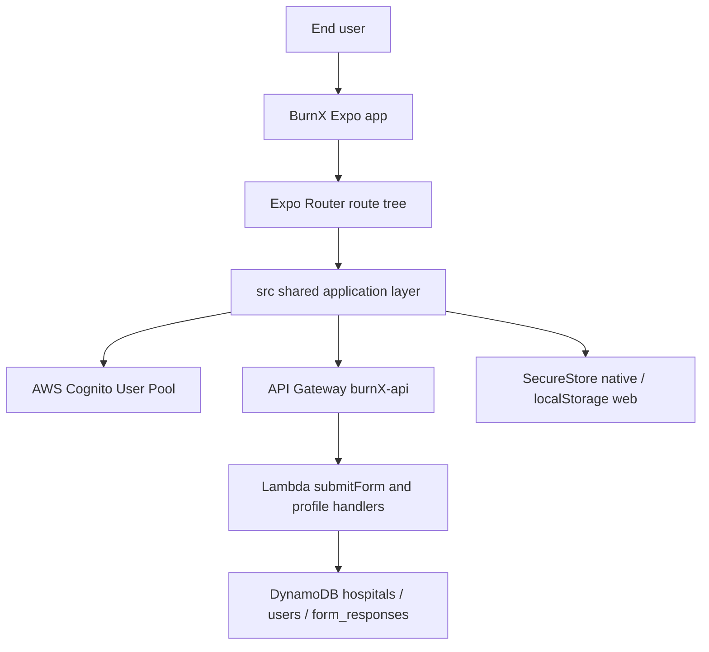

## Runtime Provider Graph

`app/_layout.tsx` is the root composition node. It owns the application-wide providers and route guards.

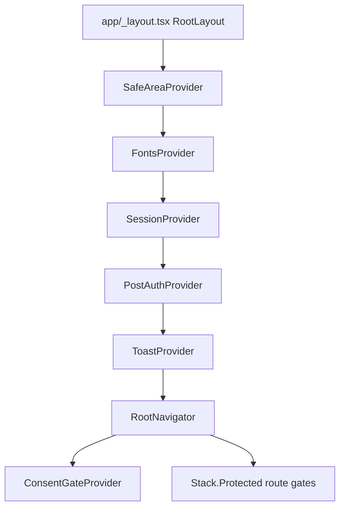

### Provider Nodes

| Node | File | Provides | Depends on |
|------|------|----------|------------|
| `FontsProvider` | `src/providers/FontsProvider.tsx` | Inter font readiness and splash-screen hiding | `expo-font`, `expo-splash-screen`, theme colors |
| `SessionProvider` | `src/lib/auth-context.tsx` | `session`, `role`, `isLoading`, `refresh`, `signOut` | `src/lib/auth.ts`, `src/lib/jwt.ts`, `src/lib/storage.ts` |
| `PostAuthProvider` | `src/lib/post-auth-context.tsx` | `ready`, `needsOnboarding`, `me`, `refetch` | `src/lib/api.ts`, `useSession` |
| `ToastProvider` | `src/components/ToastProvider.tsx` | Global toast display | Reanimated, safe-area, Ionicons, theme |
| `ConsentGateProvider` | `src/lib/consent-gate-context.tsx` | `markConsentRecorded` callback for modal completion | Root navigator local state |
| `OnboardingProvider` | `src/state/onboarding-context.tsx` | In-memory onboarding answers and setters | `BURN_INTAKE_FORM` for answer filtering |

## Route Knowledge Graph

```mermaid
graph TD
  Root["app/_layout.tsx"]
  Public["app/index.tsx"]
  AuthGroup["app/(auth)/_layout.tsx"]
  Login["app/(auth)/login.tsx"]
  Signup["app/(auth)/signup.tsx"]
  Confirm["app/(auth)/confirm.tsx"]
  OnboardingGroup["app/(onboarding)/_layout.tsx"]
  OnboardingEntry["app/(onboarding)/index.tsx"]
  ProfileCreation["app/(onboarding)/profile-creation.tsx"]
  Intake["app/(onboarding)/intake/[section].tsx"]
  Review["app/(onboarding)/review.tsx"]
  ModalGroup["app/(modal)/_layout.tsx"]
  Consent["app/(modal)/consent.tsx"]
  PatientGroup["app/(app)/_layout.tsx"]
  PatientHome["app/(app)/index.tsx"]
  FormsStack["app/(app)/forms/_layout.tsx"]
  FormsList["app/(app)/forms/index.tsx"]
  FormRunner["app/(app)/forms/[formId].tsx"]
  Profile["app/(app)/profile.tsx"]
  DoctorGroup["app/(app-doctor)/_layout.tsx"]
  DoctorHome["app/(app-doctor)/index.tsx"]

  Root --> Public
  Root --> AuthGroup
  Root --> OnboardingGroup
  Root --> ModalGroup
  Root --> PatientGroup
  Root --> DoctorGroup
  AuthGroup --> Login
  AuthGroup --> Signup
  AuthGroup --> Confirm
  OnboardingGroup --> OnboardingEntry
  OnboardingGroup --> ProfileCreation
  OnboardingGroup --> Intake
  OnboardingGroup --> Review
  ModalGroup --> Consent
  PatientGroup --> PatientHome
  PatientGroup --> FormsStack
  FormsStack --> FormsList
  FormsStack --> FormRunner
  PatientGroup --> Profile
  DoctorGroup --> DoctorHome
```

### Route Nodes

| Route node | File | Role in graph | Primary outgoing edges |
|------------|------|---------------|------------------------|
| Root router | `app/_layout.tsx` | Provider root and route gate | `provides` providers, `gates` route groups |
| Welcome | `app/index.tsx` | Logged-out landing | `renders` `Screen`, `Button`, `TrustFooter`; `navigates` to `/login` |
| Auth layout | `app/(auth)/_layout.tsx` | Stack for auth pages | `contains` login/signup/confirm |
| Login | `app/(auth)/login.tsx` | Role-aware sign-in form | `uses` `useLoginForm`, `Input`, `Card`, `Button` |
| Signup | `app/(auth)/signup.tsx` | Role-aware signup form | `uses` `useSignupForm`, `SegmentedControl`, `signupEmailHints` |
| Confirm | `app/(auth)/confirm.tsx` | Email code verification | `uses` `useConfirmSignupForm` |
| Onboarding layout | `app/(onboarding)/_layout.tsx` | Stack plus onboarding answer context | `provides` `OnboardingProvider` |
| Onboarding entry | `app/(onboarding)/index.tsx` | Redirect helper | `redirects` to profile creation |
| Profile creation | `app/(onboarding)/profile-creation.tsx` | First onboarding form | `uses` role, onboarding constants, validation |
| Intake section | `app/(onboarding)/intake/[section].tsx` | Patient burn intake section runner | `uses` `FormRenderer`, validation, onboarding answer context |
| Review | `app/(onboarding)/review.tsx` | Saves profile and intake | `calls` `createMe`, `submitFormResponse`, `refetch` |
| Modal layout | `app/(modal)/_layout.tsx` | Modal presentation stack | `contains` consent |
| Consent | `app/(modal)/consent.tsx` | Blocking study consent UI | `uses` consent copy, `recordConsent`, `ConsentGateProvider` |
| Patient tabs | `app/(app)/_layout.tsx` | Patient tab shell | `contains` Home, Forms, Profile |
| Patient home | `app/(app)/index.tsx` | Patient dashboard | `uses` `usePostAuth`, dashboard components |
| Forms stack | `app/(app)/forms/_layout.tsx` | Nested stack under Forms tab | `contains` list and dynamic runner |
| Forms list | `app/(app)/forms/index.tsx` | Assignment catalogue | `uses` form constants and assignment eligibility |
| Form runner | `app/(app)/forms/[formId].tsx` | Dynamic questionnaire engine UI | `uses` form engine, assignment eligibility, API submit |
| Profile | `app/(app)/profile.tsx` | User profile and sign out | `uses` hospitals, `useSession.signOut` |
| Doctor layout | `app/(app-doctor)/_layout.tsx` | Doctor stack shell | `contains` doctor home |
| Doctor home | `app/(app-doctor)/index.tsx` | Clinician placeholder dashboard | `uses` `usePostAuth`, `useSession.signOut` |

## Route Gate Graph

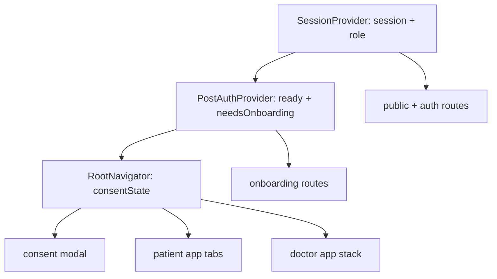

| Gate | Condition in root layout | Opened route group |
|------|--------------------------|--------------------|
| Public/auth | `!session` | `index`, `(auth)` |
| Onboarding | `session && needsOnboarding` | `(onboarding)` |
| Consent modal | eligible signed-in shell user and `consentState === "required"` | `(modal)` |
| Patient app | patient session, post-auth ready, onboarding complete, consent complete | `(app)` |
| Doctor app | doctor session, post-auth ready, onboarding complete, consent complete | `(app-doctor)` |

## Authentication Knowledge Graph

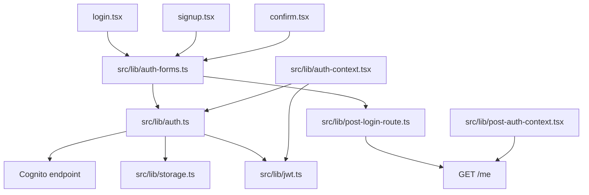

### Auth Function Nodes

| Function | File | Calls / persists | Output |
|----------|------|------------------|--------|
| `signUp` | `src/lib/auth.ts` | Cognito `SignUp`; writes custom role attribute | Signup response |
| `confirmSignUp` | `src/lib/auth.ts` | Cognito `ConfirmSignUp` | Confirmation response |
| `signIn` | `src/lib/auth.ts` | Cognito `InitiateAuth USER_PASSWORD_AUTH`; persists tokens | `AuthResult` |
| `refreshSession` | `src/lib/auth.ts` | Cognito `InitiateAuth REFRESH_TOKEN_AUTH`; refreshes access/id tokens | Refreshed auth result |
| `getValidIdToken` | `src/lib/auth.ts` | Reads expiry, refreshes near expiry | ID token or `null` |
| `signOut` | `src/lib/auth.ts` | Clears assignment caches and auth tokens | Local logged-out state |
| `isLoggedIn` | `src/lib/auth.ts` | Reads refresh token | Boolean |
| `decodeJwtPayload` | `src/lib/jwt.ts` | Base64URL payload decode only | Claims object or `null` |
| `parseRoleFromPayload` | `src/lib/jwt.ts` | Reads `custom:role` | `patient`, `doctor`, or `null` |

## API Knowledge Graph

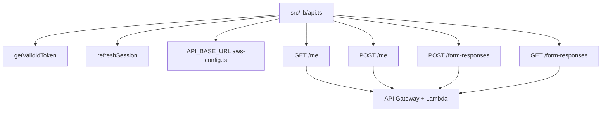

| API helper | HTTP contract | Called by | Purpose |
|------------|---------------|-----------|---------|
| `getMe` | `GET /me` | post-auth bootstrap, post-login route | Determines whether server profile exists and onboarding is complete |
| `createMe` | `POST /me` | onboarding review | Persists patient/doctor profile row |
| `submitFormResponse` | `POST /form-responses` | onboarding review, form runner, consent | Saves burn intake, LIBRE/PSQI answers, consent record |
| `getMyFormResponses` | `GET /form-responses?form_id=&limit=` | consent check, burn date helpers, assignment eligibility | Reads current user's submissions |
| `explainReachabilityError` | local helper | API error handling | Converts fetch/network failures into user-readable messages |

## Onboarding Knowledge Graph

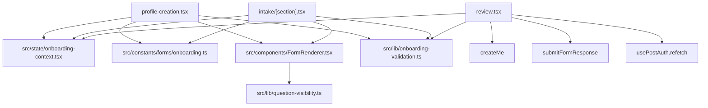

### Onboarding Data Entities

| Entity | File | Shape / role |
|--------|------|--------------|
| `PATIENT_ONBOARDING_FORM` | `src/constants/forms/onboarding.ts` | Name and hospital picker for patient users |
| `DOCTOR_ONBOARDING_FORM` | `src/constants/forms/onboarding.ts` | Name, hospital, title, specialty, department |
| `BURN_INTAKE_FORM` | `src/constants/forms/onboarding.ts` | Multi-section patient burn questionnaire |
| `Question` | `src/constants/forms/onboarding.ts` | Union of text, number, date, time, select, scale, boolean, hospital picker |
| `OnboardingAnswersValue` | `src/state/onboarding-context.tsx` | In-memory answer map plus setters/reset |
| `collectBurnIntakeAnswers` | `src/state/onboarding-context.tsx` | Filters only burn intake answers before POST |

## Consent Knowledge Graph

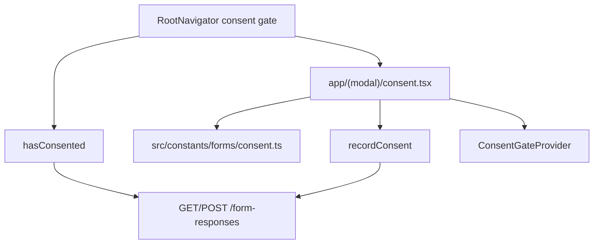

| Node | File | Knowledge |
|------|------|-----------|
| Consent version | `src/constants/forms/consent.ts` | `CONSENT_VERSION = "consent_v1"` |
| Consent content | `src/constants/forms/consent.ts` | Modal copy, checkboxes, controls |
| Consent check | `src/lib/consent.ts` | Reads recent `form-responses` for `consent_v1` |
| Consent record | `src/lib/consent.ts` | Stores consent as a `form-responses` row |
| Consent modal | `app/(modal)/consent.tsx` | Blocks shell until recorded |

## Care Programs / Questionnaire Knowledge Graph

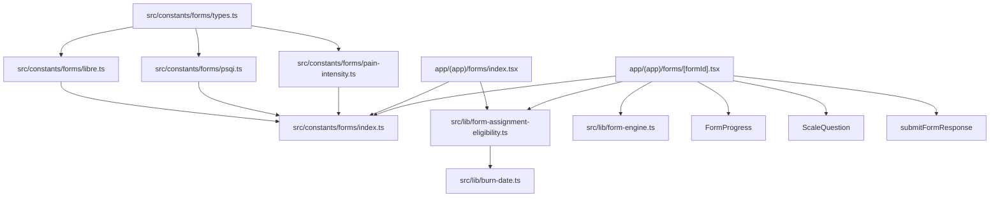

### Questionnaire Entities

| Entity | File | Role |
|--------|------|------|
| `ScaleQuestionnaireForm` | `src/constants/forms/types.ts` | Scale-form definition with sections/questions/scales/cadence |
| `LIBRE_FORM` | `src/constants/forms/libre.ts` | Registered patient care program |
| `PSQI_FORM` | `src/constants/forms/psqi.ts` | Registered sleep questionnaire |
| `ALL_FORMS` | `src/constants/forms/index.ts` | Ordered registry used by list and lookup |
| `FORMS_BY_ID` | `src/constants/forms/index.ts` | Route lookup map |
| `forms` | `src/constants/forms/index.ts` | UI catalogue projection |
| `ScaleAnswers` | `src/constants/forms/types.ts` | `Record<string, number>` answer map |

### Form Engine Nodes

| Function | File | Derives |
|----------|------|---------|
| `flattenQuestions` | `src/lib/form-engine.ts` | Stable section-then-question order |
| `isVisible` | `src/lib/form-engine.ts` | Conditional visibility from `showIf.anyOf` |
| `visibleQuestions` | `src/lib/form-engine.ts` | Current visible set |
| `firstUnansweredVisible` | `src/lib/form-engine.ts` | Next question after answer changes |
| `prevVisibleQuestionId` | `src/lib/form-engine.ts` | Back navigation target |
| `progressMeta` | `src/lib/form-engine.ts` | Current question index and total |
| `progressFillRatio` | `src/lib/form-engine.ts` | Progress bar ratio |
| `trimAnswersThroughVisibleQuestion` | `src/lib/form-engine.ts` | Removes stale downstream answers when navigating back |

## Assignment Eligibility Graph

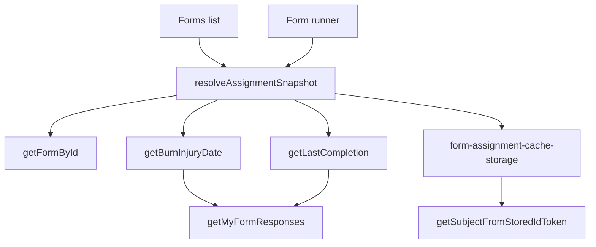

| Node | File | Responsibility |
|------|------|----------------|
| `resolveAssignmentSnapshot` | `src/lib/form-assignment-eligibility.ts` | Combines injury date, latest completion, cadence, and cache |
| `isDueForCadence` | `src/lib/form-assignment-eligibility.ts` | Compares last completion to cadence in days |
| `persistAssignmentSubmissionClientTime` | `src/lib/form-assignment-eligibility.ts` | Hides a completed cadence form immediately after POST |
| `getBurnInjuryDate` | `src/lib/burn-date.ts` | Extracts injury date from burn intake form responses |
| `getLastCompletion` | `src/lib/burn-date.ts` | Finds latest submission timestamp for a form |
| `setAssignmentLastCompletedIso` | `src/lib/form-assignment-cache-storage.ts` | Stores completion timestamp keyed by subject/form |

## Component Knowledge Graph

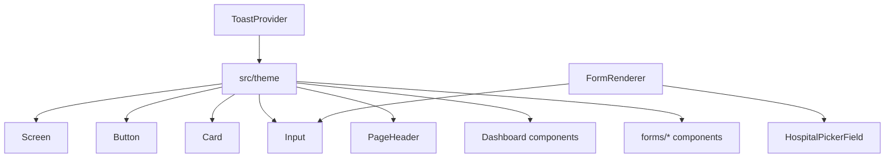

| Component | File | Used by | Notes |
|-----------|------|---------|-------|
| `Screen` | `src/components/Screen.tsx` | Most routes | Shared page chrome, safe area, optional scroll/keyboard/animation |
| `Button` | `src/components/Button.tsx` | Auth, onboarding, profile, modal, doctor shell | Variant-based CTA |
| `Card` | `src/components/Card.tsx` | Forms/onboarding/profile | Surface wrapper variants |
| `Input` | `src/components/Input.tsx` | Auth forms, FormRenderer | Labeled text input |
| `PageHeader` | `src/components/PageHeader.tsx` | Auth, onboarding, forms, profile | Back affordance + screen heading |
| `FormRenderer` | `src/components/FormRenderer.tsx` | Onboarding routes | Renders onboarding `Question` union |
| `HospitalPickerField` | `src/components/HospitalPickerField.tsx` | FormRenderer | Hospital selector from constants |
| `SegmentedControl` | `src/components/SegmentedControl.tsx` | Signup | Role control |
| `ToastProvider` | `src/components/ToastProvider.tsx` | Root provider; routes call `useToast` | Global error/info toast |
| `TrustFooter` | `src/components/TrustFooter.tsx` | Welcome/profile | Trust/privacy copy |
| `MetricCard` | `src/components/MetricCard.tsx` | Patient home | Dashboard stat surface |
| `DashboardWelcomeHeader` | `src/components/DashboardWelcomeHeader.tsx` | Patient/doctor homes | Role-aware dashboard intro |
| `AssistiveClinicalNotice` | `src/components/AssistiveClinicalNotice.tsx` | Patient/doctor homes | Clinical disclaimer/notice |
| `EmptyState` | `src/components/EmptyState.tsx` | Dashboard/forms | Empty work states |
| `SkeletonBlock`, `SkeletonClinicalTable` | `src/components/Skeleton.tsx` | Loading/table placeholders | Animated skeletons |
| `FlowStatusBanner` | `src/components/forms/FlowStatusBanner.tsx` | Forms list/runner | Assignment/form status text |
| `FormProgress` | `src/components/forms/FormProgress.tsx` | Form runner | Progress indicator |
| `ScaleQuestion` | `src/components/forms/ScaleQuestion.tsx` | Form runner | Scale option UI |

## Theme Knowledge Graph

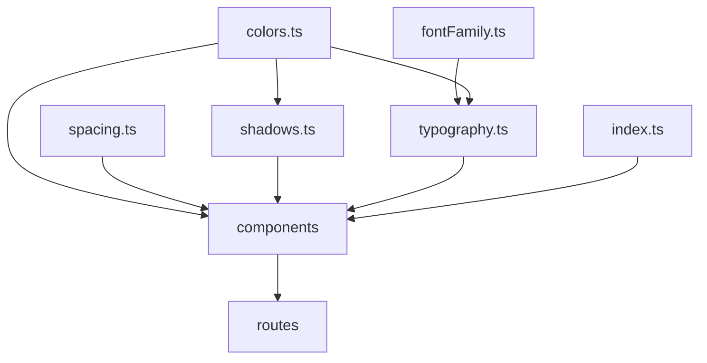

| Token module | File | Exports |
|--------------|------|---------|
| Colors | `src/theme/colors.ts` | Brand, surface, text, border, status colors |
| Font family | `src/theme/fontFamily.ts` | Inter/system font references |
| Spacing/radius | `src/theme/spacing.ts` | Spatial scale and radii |
| Shadows | `src/theme/shadows.ts` | Platform-aware shadow presets |
| Typography | `src/theme/typography.ts` | Text styles using `fontFamily` |
| Index | `src/theme/index.ts` | Barrel exports for theme modules |

## Storage Knowledge Graph

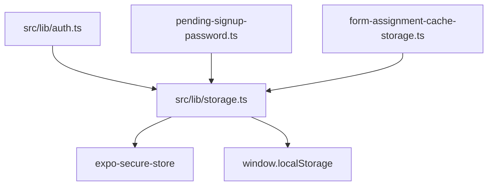

| Storage key family | Owner | Purpose |
|--------------------|-------|---------|
| `accessToken` | `src/lib/auth.ts` | Cognito access token |
| `idToken` | `src/lib/auth.ts` | Cognito id token used for API bearer auth and client role decode |
| `refreshToken` | `src/lib/auth.ts` | Session continuity |
| `tokenExpiresAt` | `src/lib/auth.ts` | Refresh-before-expiry decision |
| pending signup password | `src/lib/pending-signup-password.ts` | Temporary password handoff for post-confirm login |
| assignment completion cache | `src/lib/form-assignment-cache-storage.ts` | Per-subject, per-form local cadence cache |

## External System Nodes

| Node | Configuration | Used by | Notes |
|------|---------------|---------|-------|
| Cognito region | `aws-config.ts` `COGNITO.region` | `src/lib/auth.ts` | Builds `https://cognito-idp.<region>.amazonaws.com/` |
| Cognito user pool | `aws-config.ts` `COGNITO.userPoolId` | Documentation/config reference | Claims include role |
| Cognito app client | `aws-config.ts` `COGNITO.clientId` | `signUp`, `confirmSignUp`, `signIn`, `refreshSession` | Uses non-SRP password flow |
| API Gateway | `aws-config.ts` `API_BASE_URL` | `src/lib/api.ts` | Backing endpoints: `/me`, `/form-responses` |
| DynamoDB | Backend side | API Gateway/Lambda | Client sees this through REST responses only |

## End-to-End Flow Graphs

### Signup Flow

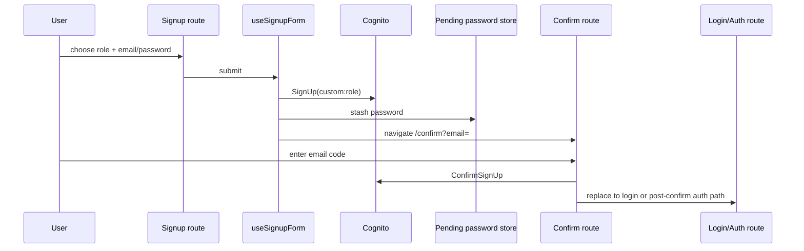

### Login and Route Resolution

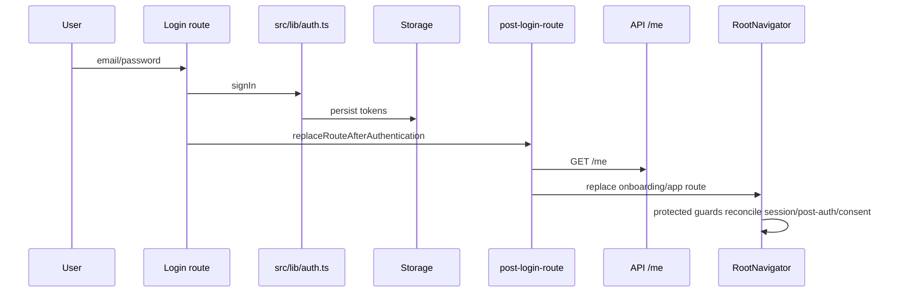

### Patient Onboarding Submit

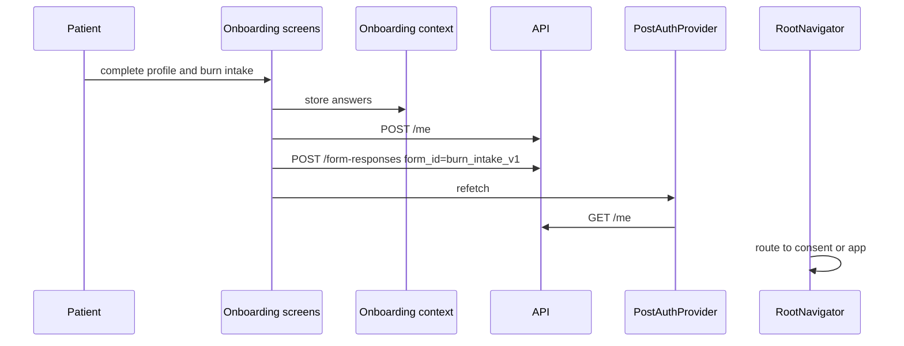

### Consent Gate

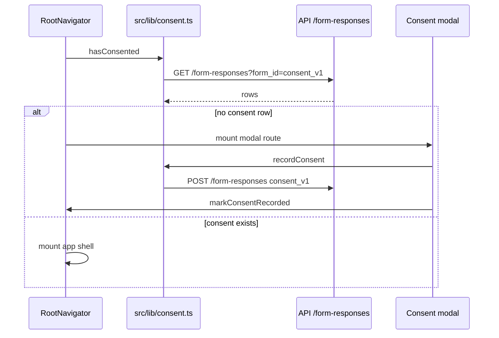

### Care Program Form Submission

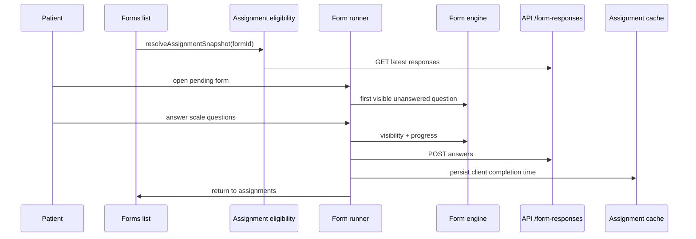

## Import Edge Catalogue

### Route to Shared Module Edges

| Route | Shared modules used |
|-------|---------------------|
| `app/index.tsx` | `Button`, `Screen`, `TrustFooter`, `debug-log`, theme |
| `app/(auth)/login.tsx` | `Button`, `Card`, `Input`, `PageHeader`, `Screen`, `useLoginForm`, `debug-log`, theme |
| `app/(auth)/signup.tsx` | `Button`, `Card`, `Input`, `PageHeader`, `Screen`, `SegmentedControl`, `signupEmailHints`, `useSignupForm`, theme |
| `app/(auth)/confirm.tsx` | `Button`, `Card`, `Input`, `PageHeader`, `Screen`, `useConfirmSignupForm`, `debug-log`, theme |
| `app/(onboarding)/profile-creation.tsx` | `Button`, `Card`, `FormRenderer`, `PageHeader`, `Screen`, `ToastProvider`, onboarding constants, `useSession`, validation, onboarding state |
| `app/(onboarding)/intake/[section].tsx` | `Button`, `Card`, `FormRenderer`, `PageHeader`, `Screen`, `ToastProvider`, `BURN_INTAKE_FORM`, `useSession`, validation, onboarding state |
| `app/(onboarding)/review.tsx` | `Button`, `Card`, `PageHeader`, `Screen`, `ToastProvider`, onboarding constants, `createMe`, `submitFormResponse`, `useSession`, `usePostAuth`, onboarding state |
| `app/(modal)/consent.tsx` | `Button`, consent constants, `useSession`, `useConsentGate`, `recordConsent`, `ToastProvider`, theme |
| `app/(app)/index.tsx` | dashboard components, `Screen`, `usePostAuth`, theme |
| `app/(app)/forms/index.tsx` | `Card`, `EmptyState`, `PageHeader`, `Screen`, forms constants, assignment eligibility, flow banner |
| `app/(app)/forms/[formId].tsx` | `Screen`, `PageHeader`, `Button`, form chrome, forms registry, form engine, burn-date, assignment eligibility, API submit |
| `app/(app)/profile.tsx` | `Button`, `Card`, `PageHeader`, `Screen`, `TrustFooter`, hospitals, `useSession`, theme |
| `app/(app-doctor)/index.tsx` | dashboard components, `Button`, `Screen`, `useSession`, `usePostAuth`, theme |

### Shared Module to Shared Module Edges

| Source | Edges |
|--------|-------|
| `src/lib/auth-forms.ts` | `auth`, `debug-log`, `auth-context`, `post-login-route`, `pending-signup-password` |
| `src/lib/auth.ts` | `aws-config`, `debug-log`, `form-assignment-cache-storage`, `jwt`, `storage` |
| `src/lib/auth-context.tsx` | `auth`, `debug-log`, `jwt`, `storage` |
| `src/lib/post-auth-context.tsx` | `api`, `auth-context`, `debug-log` |
| `src/lib/post-login-route.ts` | `api`, `debug-log`, `jwt` |
| `src/lib/api.ts` | `aws-config`, `auth`, `debug-log`, React Native `Platform` |
| `src/lib/consent.ts` | `api`, consent constants |
| `src/lib/form-assignment-eligibility.ts` | forms registry, burn-date, assignment cache, jwt |
| `src/lib/burn-date.ts` | `api` |
| `src/lib/form-engine.ts` | LIBRE form types |
| `src/lib/onboarding-validation.ts` | onboarding question type, question visibility |
| `src/components/FormRenderer.tsx` | onboarding question type, hospital picker, question visibility, theme |
| `src/components/HospitalPickerField.tsx` | hospitals constants, debug-log, theme |
| `src/constants/forms/index.ts` | LIBRE, PSQI, LIBRE form types |
| `src/theme/typography.ts` | font family |
| `src/theme/shadows.ts` | colors |

## Architectural Invariants

| Invariant | Enforced by |
|-----------|-------------|
| Route files live under `app/`; shared UI/business code lives under `src/` | Current folder structure |
| Auth uses direct Cognito API calls, not AWS Amplify | `src/lib/auth.ts`; no `aws-amplify` dependency |
| Local token storage uses SecureStore on native and localStorage on web | `src/lib/storage.ts` |
| API calls attach Cognito id token as Bearer token | `src/lib/api.ts` |
| Root route access is based on session, onboarding completion, role, and consent state | `app/_layout.tsx` |
| Patient and doctor shells are separate route groups | `app/(app)` and `app/(app-doctor)` |
| Patient onboarding writes both profile and burn intake; doctor onboarding writes profile only | `app/(onboarding)/review.tsx` |
| Consent is represented as a form response with `form_id = consent_v1` | `src/lib/consent.ts` |
| Assignment visibility is derived from backend submissions plus cadence | `src/lib/form-assignment-eligibility.ts` |

## High-Risk Couplings

| Coupling | Why it matters | Files |
|----------|----------------|-------|
| JWT `custom:role` drives shell selection | Missing/invalid role pushes users into onboarding or blocks shell mounting | `src/lib/jwt.ts`, `src/lib/auth-context.tsx`, `app/_layout.tsx` |
| `/me.onboarding_completed` gates onboarding vs app | Backend shape changes directly affect navigation | `src/lib/api.ts`, `src/lib/post-auth-context.tsx` |
| Consent rows use `form-responses` | Consent gate depends on generic form response API availability | `src/lib/consent.ts`, `app/_layout.tsx` |
| `BURN_INTAKE_FORM.id` is persisted remotely | Changing id breaks historical burn-date extraction unless migrated | `src/constants/forms/onboarding.ts`, `src/lib/burn-date.ts` |
| Form answer values are numeric option indices | Scale label/order changes alter semantic meaning of stored answers | `src/constants/forms/libre.ts`, `src/constants/forms/psqi.ts`, `src/constants/forms/types.ts` |
| Local assignment cache is keyed by Cognito subject | Subject decode failure disables cache write/clear | `src/lib/jwt.ts`, `src/lib/form-assignment-cache-storage.ts` |

## File Ownership Map

| Folder | Owns | Does not own |
|--------|------|--------------|
| `app/` | Route composition, navigation transitions, screen-level wiring | Reusable UI primitives, API contracts, auth implementation, domain constants |
| `src/components/` | Reusable UI components and providers with visual behavior | Network calls, Cognito logic, domain form definitions |
| `src/components/forms/` | Questionnaire-specific presentation components | Form registry, answer visibility logic |
| `src/constants/` | Hardcoded domain data and form definitions | Runtime state, network calls |
| `src/lib/` | Auth, API, routing helpers, visibility/validation engines, consent, assignment logic | Route rendering and reusable visual components |
| `src/providers/` | Cross-cutting non-domain providers | Auth/session policy |
| `src/state/` | Client-side feature state contexts | Persistent storage and network calls |
| `src/theme/` | Design tokens | Business logic |
| `assets/` | Static app images | UI behavior |

## Validation Checklist for Future Changes

1. New screen goes in `app/`; any reusable UI goes in `src/components/`.
2. New API call goes in `src/lib/api.ts` or a dedicated `src/lib/*` module that uses `getValidIdToken`.
3. New protected route must be represented in `app/_layout.tsx` gate logic.
4. New patient questionnaire should be registered in `src/constants/forms/index.ts`.
5. New stored answer semantics must preserve historical interpretation or include migration notes.
6. New auth behavior must keep Amplify and `react-native-keychain` out of dependencies.
7. New consent/study version must update `CONSENT_VERSION` and backend expectations.
8. New local cache must clear on `signOut` when it contains user-scoped data.
